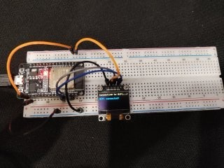

 # Arduino Telegram Bot Template 🤖

Этот проект представляет собой шаблон для создания Telegram бота на базе платформы Arduino (ESP32), который позволяет взаимодействовать с устройством через мессенджер Telegram. Проект включает OLED-дисплей для визуализации статуса и светодиодную индикацию. 💡



## Основные функции 🚀

- Автоматическое подключение к Wi-Fi сети 📶
- Взаимодействие через Telegram бота 💬
- Визуализация статуса на OLED-дисплее 128x64 🖥️
- Светодиодная индикация (мигающий светодиод) 💡
- Безопасное соединение через SSL 🔒
- Фильтрация сообщений по ID администратора 👮

## Необходимые компоненты 🛠️

- Плата ESP32
- OLED дисплей 128x64 (I2C интерфейс)
- Светодиод и резистор 220 Ом
- Плата для прототипирования (breadboard)
- Провода типа "папа-папа"

## Библиотеки 📚

Для работы проекта потребуются следующие библиотеки:
- WiFi (встроенная)
- WiFiClientSecure (встроенная)
- esp_task_wdt (встроенная)
- [UniversalTelegramBot](https://github.com/witnessmenow/Universal-Arduino-Telegram-Bot) 📦
- [ArduinoJson](https://arduinojson.org/) 📦
- [GyverOLED](https://github.com/GyverLibs/GyverOLED) 📦

Установите их через менеджер библиотек в Arduino IDE.

## Настройка проекта ⚙️

1. **Настройка Wi-Fi**  
   Замените в коде значения `SSID` и `PASSWORD` на данные вашей Wi-Fi сети:
   ```cpp
   const char* ssid_ap = "Ваш_SSID";
   const char* password_ap = "Ваш_Пароль";
   ```

2. **Настройка Telegram бота**  
   - Создайте бота через @BotFather в Telegram 👴
   - Замените `TOKEN` на полученный токен:
     ```cpp
     const char* bot_token = "ваш_токен_бота";
     ```

3. **Установка ID администратора**  
   - В функции `handleNewMessages` замените `"ADMIN_ID"` на ваш Telegram ID:
     ```cpp
     if(us_id == "ВАШ_TELEGRAM_ID")
     ```
   - Чтобы получить свой ID, отправьте сообщение /start боту, затем проверьте серийный монитор 🔍

## Схема подключения 🔌

```plaintext
ESP32   | Компонент
--------|----------
3V3     | OLED VCC
GND     | OLED GND
GPIO 21 | OLED SDA
GPIO 22 | OLED SCL
```

## Использование 🚀

1. Загрузите код на ESP32
2. Откройте серийный монитор (115200 бод) для отладки
3. В Telegram найдите созданного бота
4. Отправьте команду `/start`
5. Устройство ответит приветственным сообщением с вашим ID 👋

## Возможности расширения 🛠️

Этот шаблон можно расширить для:
- Управления реле и электроприборами 🔌
- Мониторинга датчиков (температуры, влажности) 🌡️
- Создания системы безопасности 🛡️
- Управления освещением 💡
- Получения уведомлений о событиях 📨

## Устранение неисправностей 🔧

- **Не подключается к Wi-Fi**: проверьте SSID и пароль 🔑
- **Бот не отвечает**: проверьте токен бота и интернет-соединение 🌐
- **Ошибки сертификата**: обновите корневой сертификат в библиотеке 📜
- **OLED не работает**: проверьте подключение и адрес I2C 🔄

## 📜 Лицензия

Этот проект распространяется под лицензией MIT. Подробнее см. в файле LICENSE.

---
